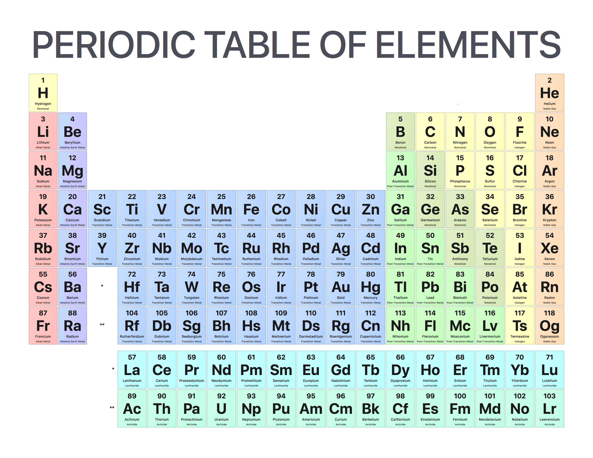

# Instructions

Use HTML to build and color the periodic table as seen in the image below.

Here are the colors used in the image above:

- #FFFECC
- #FFD2CF
- #D2D3FF
- #C6DEFF
- #E3EFC7
- #CFFDC9
- #FFFECC
- #FFE4C7
- #C9FEFF
- #CFFDEC
